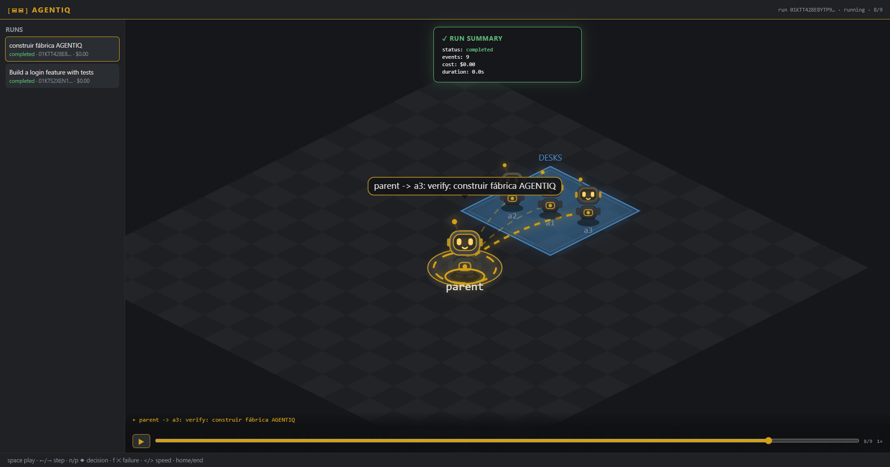
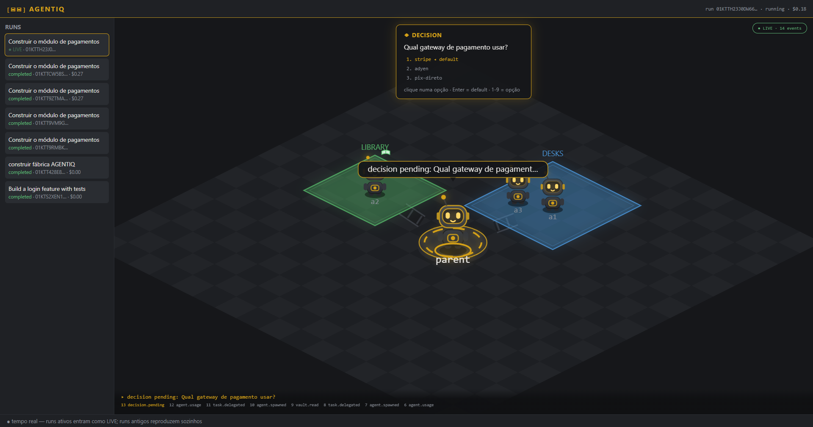
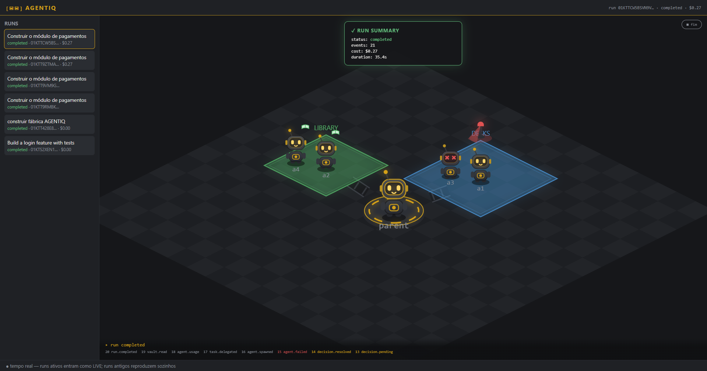

<div align="center">

# `[▣▣]` AGENTIQ

**Ferramenta de agentes** — orquestre times de agentes Claude no seu repositório
e **assista tudo acontecer em tempo real** numa fábrica isométrica de robôs.

[🏭 **Demo ao vivo (runs reais gravados)**](https://wellington-hmv.github.io/agentiq/demo/) ·
[Arquitetura](#arquitetura) · [Quickstart](#quickstart)



</div>

---

## O que é

Você abre uma **demanda** ("construa o módulo de pagamentos") apontada para um
repositório. Um agente líder (**MAIN**, no pódio dourado) decompõe o objetivo,
contrata subagentes, consulta vaults de conhecimento e trabalha de forma
autônoma — enquanto a interface mostra **cada evento como uma cena viva**:

- 🤖 **Robôs** com olhos que são o estado real: `◉◉` lendo vault, `⚙⚙` pensando,
  `✕✕` falhou, `✓✓` pronto. Eles **andam** entre setores, levantando poeirinha.
- 🏗️ **A fábrica cresce**: cada setor se constrói em animação quando o primeiro
  agente chega; a câmera abre conforme o time aumenta.
- ➤ **Setas de demanda** disparam só no momento da delegação (MAIN → líder →
  subordinado) e somem — sem teia de linhas.
- 📦 **Esteiras** sempre girando levam um **caixote** com a tarefa até o setor.
- 🚨 **Sirene giratória** acende no setor enquanto houver robô falhado.
- ◆ **Decisões pausam o mundo**: um card dourado mostra as opções — responda
  clicando, com `1`–`9` ou `Enter` (default) — e a fábrica religa.

Nada disso é enfeite: **cada pixel deriva de um evento real** do log. O mesmo
reducer puro alimenta o modo ao vivo, o replay e a interface — live e replay
nunca divergem.

> 🤖 *Dogfood*: a seção "Interface Web" deste README foi escrita pelos próprios
> agentes do AGENTIQ, como demanda real aberta pelo browser (run `01KTV9QS…`,
> $0.35: parent → investigator → builder).

## Demo

**[wellington-hmv.github.io/agentiq/demo](https://wellington-hmv.github.io/agentiq/demo/)** —
dois runs reais gravados, reproduzidos pelo mesmo código do produto:

1. **Agentes documentando o próprio produto** — o run que escreveu a seção
   "Interface Web (Fábrica)" abaixo.
2. **Run com decisão humana + falha** — o card ◆ pausa o mundo (no produto a
   resposta veio do browser: `adyen`, `resolved_by: human`) e a sirene acende
   quando um robô falha.

| Decisão pelo browser | Sirene de falha |
|---|---|
|  |  |

## Quickstart

Requisitos: Python ≥ 3.11 · [uv](https://docs.astral.sh/uv/) · para agentes
reais, login do [Claude Code](https://claude.com/claude-code) (assinatura — sem
`ANTHROPIC_API_KEY` no ambiente).

```bash
uv sync                 # venv + dependências
uv run agentiq web      # sobe a fábrica em http://127.0.0.1:8642/ e abre o browser
```

Na interface: **+ nova demanda** → descreva o objetivo → informe o **repositório
alvo** → marque **agentes reais (Claude)** → `▶ iniciar demanda`. A fábrica gruda
no run nascendo; você assiste e decide ao vivo.

Pela CLI:

```bash
uv run agentiq run "Construa X" --project caminho/do/repo --live --web
uv run agentiq runs               # lista runs
uv run agentiq replay <run-id>    # timeline no terminal (TUI com --scene)
```

## Interface Web (Fábrica)

```bash
uv run agentiq web                # sobe a fábrica em http://127.0.0.1:8642/ e abre o browser
uv run agentiq web --port 9000    # porta customizada
uv run agentiq web --no-browser   # não abre o browser automaticamente
```

- **Nova demanda**: clique em `+ nova demanda`, descreva o objetivo, informe o
  repositório alvo (vazio = diretório atual) e marque `agentes reais (Claude)`
  para usar agentes de verdade — desmarcado, roda a estratégia determinística
  offline. `▶ iniciar demanda` cria o run e já abre a visão ao vivo.
- **Modo LIVE**: runs em execução são acompanhados em tempo real via WebSocket —
  o pill `● LIVE · N events` indica o streaming; ao terminar vira `■ finished`.
  Clicar num run `running`/`pending` na sidebar também entra em LIVE.
- **Modo cinema**: clicar num run finalizado reproduz o log de eventos em ritmo
  natural (`▶ reprise`). `Espaço` pausa/retoma.
- **Decisões pendentes**: em LIVE, um card `◆ DECISION` aparece com as opções.
  Responda clicando numa opção, com `1`–`9`, ou `Enter` para o default.

## Segurança e custo

- **Escopo confinado**: agentes reais trabalham dentro do repositório alvo
  (SafetyGuard + `cwd`); ferramentas proibidas via `denied_ops` são bloqueio
  duro no CLI.
- **Teto de custo**: `ceiling_usd` no `agentiq.config.toml` vira
  `max_budget_usd` no SDK — o gasto para no limite, em pleno voo.
- **Decisões `ask`**: a política de autonomia roteia decisões para o humano —
  no browser (card ◆) ou no terminal — e tudo fica gravado no log
  (`decision.pending` → `decision.resolved`, com quem resolveu).
- Config por repositório (`agentiq.config.toml`):

```toml
[cost]
ceiling_usd = 1.0      # runs live param em $1

[autonomy]
default = "ask"        # decisões pedem confirmação humana
```

## Arquitetura

**Event sourcing de ponta a ponta.** O orquestrador headless é o único produtor
de um log JSONL append-only (fsync por evento) — o log É o banco. Todo o resto é
assinante puro:

```
orquestrador ──▶ EventBus ──▶ events.jsonl  (única fonte de verdade)
                                  │
            ┌─────────────────────┼──────────────────────┐
            ▼                     ▼                      ▼
     timeline / TUI        fábrica web (live =       custo / resumo
      (terminal)           tail do log via WS;       (projeções)
                           replay = reducer JS
                           espelho do Python)
```

- **Um reducer, duas linguagens**: `replay/reducer.py` (Python) e
  `static/reducer.js` (espelho JS) dobram os mesmos eventos no mesmo
  `SceneState` — live, replay, terminal e demo são projeções da mesma verdade.
- **Tempo real entre processos**: o servidor web *taileia* o JSONL — o run pode
  rodar em outro terminal e a fábrica acompanha mesmo assim.
- **Decisões cross-process**: a pasta do run carrega `decision.pending.json` /
  `decision.answer.json` — qualquer processo (o browser via API) pode responder.
- **Animação ≠ estado**: tweens, poeira e brilho são camada de apresentação
  entre dois estados do reducer; o determinismo nunca depende deles.
- Front da fábrica: **Canvas2D puro, zero dependências** (sem bundler, sem
  framework) — os mesmos módulos rodam no produto e na demo estática.

Specs completas (PRD, arquitetura, UX, épicos) em
`_bmad-output/planning-artifacts/`.

## Gates de qualidade

```bash
uv run pytest               # 245 testes
uv run ruff format --check .
uv run ruff check .
uv run ty check
uv run lint-imports         # core nunca importa a camada de render (NFR17)
```

## Licença

[MIT](LICENSE)
