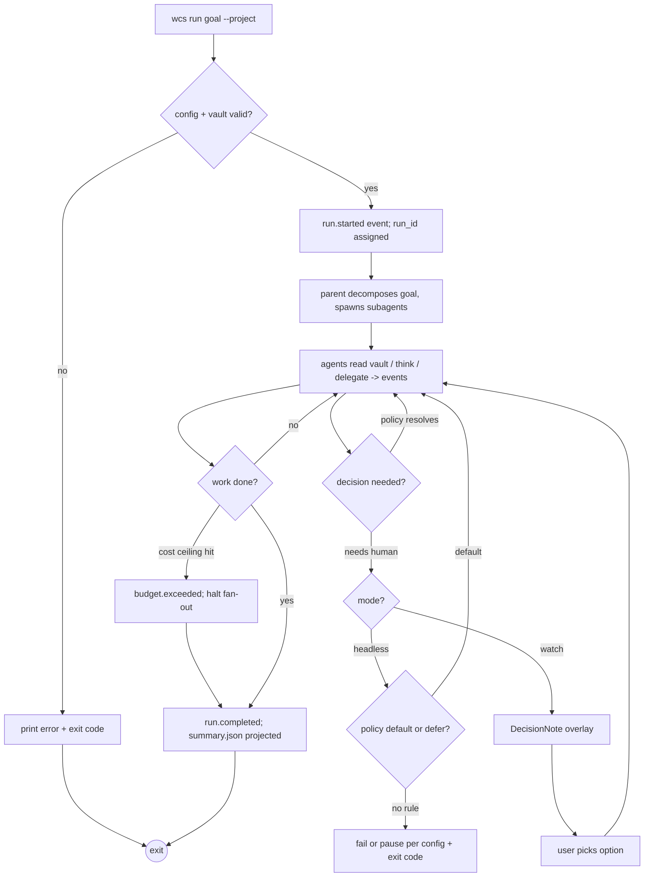
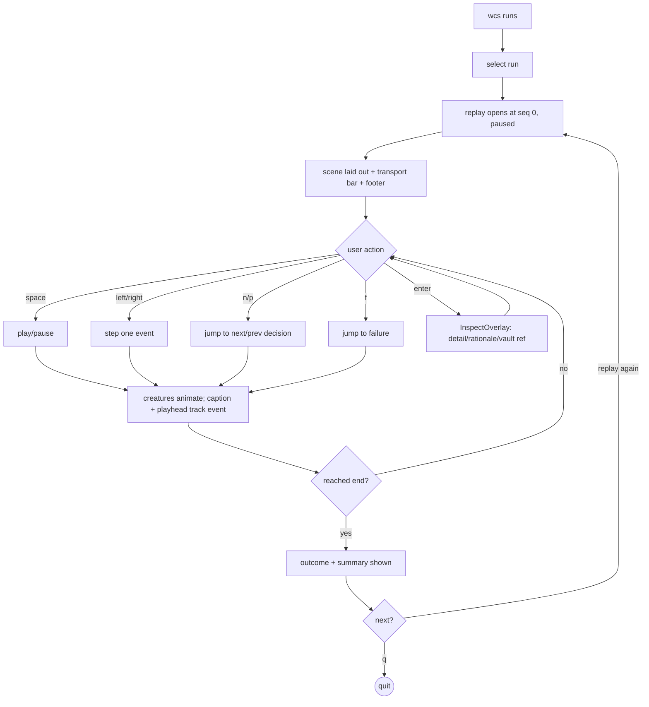
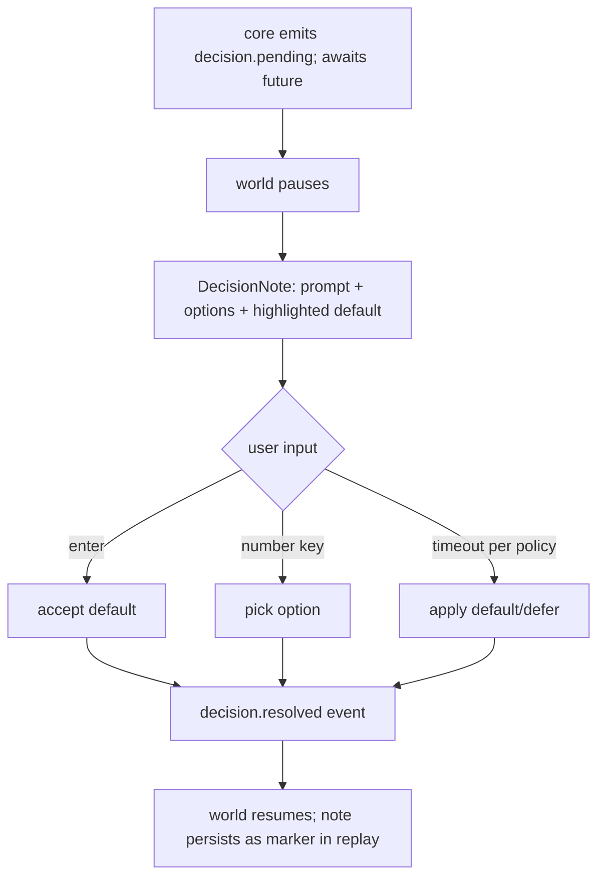
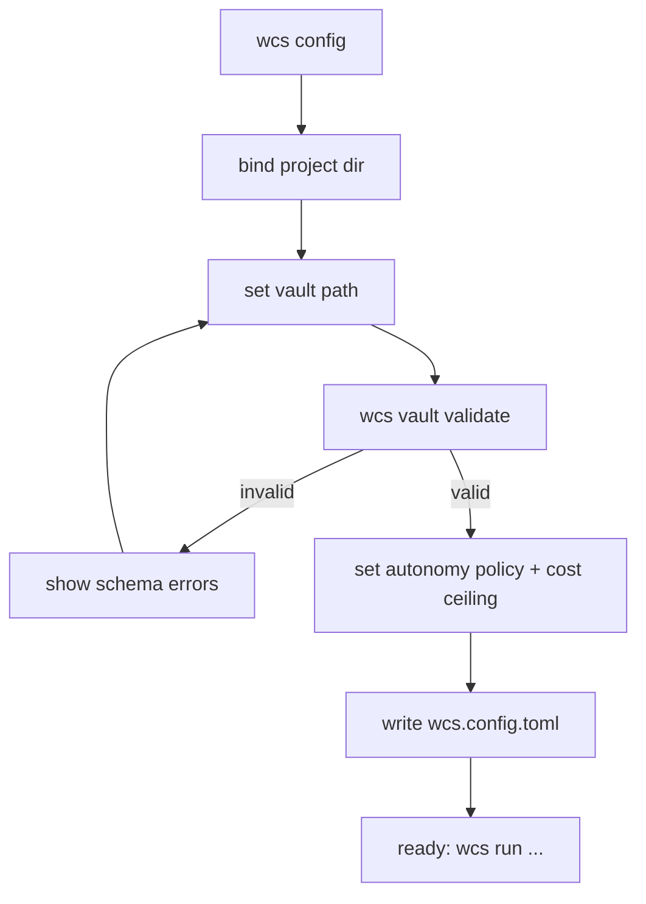

# UX Design Specification well-corp-sw

**Author:** User
**Date:** 2026-06-08

---

<!-- UX design content will be appended sequentially through collaborative workflow steps -->

## Executive Summary

### Project Vision
well-corp-sw turns invisible multi-agent orchestration into a watchable, replayable
spatial scene inside the terminal. The solo developer hands off a goal, work runs
headless, and the UX exists to answer one question fast: "what did the agents do,
and why?" The interface is a living office rendered in text — agents as creatures
moving between a library (vault), desks (thinking), and paths (delegation) — usable
live or as a scrubbable replay. The animated scene is opt-in; legible replay is the
product's heart.

### Target Users
Single persona: the solo developer (the author) orchestrating their own projects.
Highly technical, terminal-native, comfortable with CLI flags and config files.
Uses it on a desktop terminal (Win/macOS/Linux). Two modes of attention:
- **Hands-off:** kicks off headless, leaves, returns to audit via replay.
- **Watching:** keeps the live scene open for a tricky run, answers decisions.

### Key Design Challenges
- **Spatial legibility in a text grid.** Convey "who went to the vault, who is
  thinking, who delegated to whom" using terminal cells + TCSS animation — clear,
  not chaotic. The scene must read as a story, not a screensaver.
- **Replay as the killer surface.** Scrub to any point, jump to failure,
  reconstruct a full run in under ~2 minutes. Replay and live must look identical
  (same reducer) so learning transfers between modes.
- **Decisions without breaking flow.** A pending decision must surface as a clear
  on-screen note (options + visible default) that pauses the world, then resumes —
  without losing spatial context.
- **Graceful degradation.** Headless/no-TTY and "scene unavailable" must fall back
  to a plain textual timeline that loses nothing essential.
- **Scale.** Stay legible as agent count grows (zoom / group-by-team / focus-follow
  in later phases).

### Design Opportunities
- **Emotional legibility as advantage.** Borrow terminal-pet charm (Claude Buddy)
  but bend it to comprehension — creature state encodes real agent state, not cute.
- **One scene, three outputs.** Live, replay, and the plain timeline are projections
  of the same event stream — consistency is free if the visual language is shared.
- **Spatial mnemonics.** A fixed map (library / desks / delegation paths) gives the
  developer a reusable mental model so each run is read faster than the last.
- **Decision notes as sticky artifacts.** Past decisions remain visible/searchable
  in replay, turning "why did it do that?" into a one-glance answer.

## Core User Experience

### Defining Experience
The defining action is **reading a run** — opening a finished (or live) run and
understanding what the agents did and why. Everything else (kicking off, configuring)
is setup around this core loop. Success = the developer scrubs the spatial scene and
reconstructs the whole run in under ~2 minutes without touching a raw log. Get this
one interaction right and the product delivers; everything else is supporting cast.

### Platform Strategy
Terminal-only, single codebase on Win/macOS/Linux (Textual TUI). Keyboard-driven
(no mouse assumption); mouse optional where the terminal supports it. Two surfaces
from one engine: interactive TUI (live + replay) and a non-interactive plain
timeline for headless/no-TTY/piped output. No web, no mobile, no GUI.

### Effortless Interactions
- **Scrubbing the timeline.** Single keys: play/pause (space), step (←/→), jump to
  next/prev decision and to failure (n/p, f). Holding a key fast-forwards.
- **Reading agent state at a glance.** A creature's location + posture encodes its
  state (at library = reading vault, at desk = thinking, on a path = delegating);
  no legend lookup needed after first use.
- **Answering a decision.** When the world pauses on a decision note, the default is
  pre-highlighted — Enter accepts it, number keys pick an option. Zero hunting.
- **Switching live↔replay.** Identical visual language, so no relearning.

### Critical Success Moments
- **First "aha":** opening a replay and the scene tells the story by itself — the
  moment the spatial metaphor proves clearer than logs.
- **Jump-to-failure:** something broke; one key lands on the stuck point with the
  last-good state and cause visible. If this is fast and clear, trust is earned.
- **Decision moment:** a pending decision is unmistakable, the options and default
  are obvious, and resuming feels instant.
- **First-run setup success:** binding a project + vault and getting a run going
  without friction — the gate to everything else.

### Experience Principles
1. **Comprehension over spectacle.** Every visual element encodes real state; if it
   doesn't aid understanding, it doesn't ship.
2. **One visual language, every surface.** Live, replay, and timeline share meaning;
   learn once, read everywhere.
3. **Never hide the truth.** The scene always degrades to a complete plain timeline;
   nothing essential lives only in animation.
4. **Keyboard-first, zero-hunt.** Core actions are single keys with visible defaults.
5. **The map is fixed.** A stable spatial layout (library / desks / paths) builds a
   reusable mental model so each run reads faster than the last.

## Desired Emotional Response

### Primary Emotional Goals
**Calm trust.** The developer hands off work and feels safe walking away —
confident that whatever the agents do is fully reconstructable. The signature
feeling is relief: "I can always see exactly what happened." Secondary, a quiet
**delight** at watching the little office work — charm that earns a smile without
ever competing with comprehension.

### Emotional Journey Mapping
- **Discovery / first run:** curiosity → "wait, I can *watch* this?" intrigue.
- **Hand-off:** trust enough to close the laptop (not anxiety about a black box).
- **Reading the replay:** clarity and quiet satisfaction — the story reads itself.
- **Something breaks:** controlled concern, not panic — the stuck point is obvious
  and the cause is one key away.
- **Decision moment:** in-control, not interrupted — a clear ask, an easy answer.
- **Returning:** familiarity — the fixed spatial map feels like a place they know.

### Micro-Emotions
- **Trust over skepticism** — the make-or-break emotion; the whole product earns it.
- **Confidence over confusion** — never lost in the scene or the logs.
- **Control over anxiety** — autonomy never feels like loss of control.
- **Delight over indifference** — the scene sparks warmth, in service of meaning.

### Design Implications
- Calm trust → always-available, complete plain-timeline fallback; nothing hidden
  only in animation. Visible determinism (same scene every replay).
- Control → decision notes with a clear default and instant resume; hard cost
  ceiling shown, so spend never feels runaway.
- Confidence → jump-to-failure + last-good state; stable spatial map; consistent
  visual language across live/replay/timeline.
- Delight (bounded) → characterful creature motion and idle animations, but motion
  always encodes real state; tasteful, never noisy. Delight yields to legibility
  whenever they conflict.

### Emotional Design Principles
1. **Earn trust, don't ask for it** — show the full truth, every time.
2. **Charm serves clarity** — if an animation doesn't mean something, cut it.
3. **Autonomy without abandonment** — the user can always reassert control
   (pause, decide, inspect) in one keystroke.
4. **Calm by default** — quiet, legible motion; alarm reserved for real failures.

## UX Pattern Analysis & Inspiration

### Inspiring Products Analysis
- **lazygit / k9s (keyboard-first TUIs):** dense info, single-key actions, modal
  panels, always-visible keybinding hints. Prove that a terminal app can feel fast
  and effortless without a mouse — our keyboard-first, zero-hunt model.
- **Colony sims (RimWorld / Dwarf Fortress):** many autonomous agents moving with
  visible *purpose* across a fixed map; the viewer reads intent from position and
  motion. Closest analog to "read agent state spatially at a glance."
- **Factorio / automation games:** the joy of watching a system you set up run
  itself — and pausing to inspect when something jams. Mirrors hand-off + watch.
- **Claude Buddy (terminal pet):** affective charm via ASCII creatures with
  posture/animation frames. Proves the emotional pull; we borrow the charm but tie
  it to real state, not novelty.
- **Ralph TUI / agent-harbor:** real-time agent→subagent hierarchy in a terminal.
  Proves the orchestration view; we add the spatial metaphor and replay they lack.
- **Video/DAW scrubbing (timeline + playhead):** transport controls (play/pause,
  step, jump-to-marker) as a universal mental model for our replay.

### Transferable UX Patterns
**Navigation/Layout:**
- Fixed panel layout with a persistent keybinding footer (lazygit/k9s).
- A stable spatial map with named zones (library / desks / paths) like a sim map.
**Interaction:**
- Transport bar with playhead + markers for decisions and failures (DAW/video).
- Single-key jump-to-marker (next decision, failure) for fast scrubbing.
- Modal "inspect" overlay on an agent/event without leaving the scene (k9s drill-in).
**Visual:**
- Creature posture/frame encodes state (Claude Buddy), color/glyph encodes role.
- Motion-with-purpose along delegation paths (colony sims) — movement = meaning.
- Quiet idle states; reserve bold color/motion for failures and pending decisions.

### Anti-Patterns to Avoid
- **Screensaver syndrome:** motion that doesn't encode state (pure eye-candy) —
  violates "comprehension over spectacle."
- **Log-wall dashboards** (cold scrolling text with no narrative) — the exact pain
  we're replacing.
- **Mouse-dependent TUIs:** hover-only affordances that break keyboard flow.
- **Hidden state in animation:** anything you can only learn by watching live and
  can't recover in replay/timeline.
- **Modal interruption overload:** decision prompts that yank focus without context
  or a clear default (breaks calm/control).
- **Frame-rate vanity:** chasing 60fps spectacle at the cost of core throughput.

### Design Inspiration Strategy
**Adopt:**
- Keyboard-first single-key actions + persistent keybinding footer (lazygit/k9s).
- Transport bar with playhead + decision/failure markers (DAW) for replay.
- Fixed spatial map with named zones + purposeful motion (colony sims).
**Adapt:**
- Claude-Buddy-style creature charm, but every posture/frame maps to a real agent
  state; charm is bounded by legibility.
- Drill-in inspect overlay (k9s) reworked to inspect an agent/event/decision.
**Avoid:**
- Decorative motion, log walls, mouse dependence, hidden-in-live state, and
  focus-stealing modals without defaults.

## Design System Foundation

### Design System Choice
**Themeable foundation: Textual (built-in widgets + TCSS) + a custom scene token
layer.** Textual is the established base (layout, widgets, focus, key bindings,
animation engine, theming). On top we define a project-specific token set and a
small library of custom scene widgets — the spatial elements that don't exist in
any TUI toolkit (creatures, zones, delegation paths, transport bar, decision note).

### Rationale for Selection
- **Speed + uniqueness balance:** Textual gives proven plumbing (no reinventing
  focus, input, render loop, 60fps animation); the custom layer carries the
  product's unique spatial visual language.
- **Single dev, terminal-only:** an established TUI framework is the only sane base;
  custom-from-scratch rendering would burn the whole budget.
- **Consistency for free:** TCSS = one styling language (like CSS), so live, replay,
  and overlays share tokens; matches NFR "one visual language, every surface."
- **Accessibility/portability:** Textual handles cross-terminal rendering, color
  degradation, and reduced-capability terminals (truecolor → 256 → 16) for us.

### Implementation Approach
- **Base components (use as-is):** Textual `App`, `Screen`, `Footer` (keybinding
  hints), `DataTable` (`wcs runs`), `Static`/`Label`, `ProgressBar`, modal screens.
- **Custom scene widgets (build):**
  - `SceneWidget` — the fixed spatial map (library / desks / delegation paths).
  - `Creature` — an agent sprite (posture/frame = state, color/glyph = role).
  - `TransportBar` — playhead + markers (decision ◆, failure ✕) for replay.
  - `DecisionNote` — modal note: prompt, options, highlighted default.
  - `InspectOverlay` — drill-in on an agent/event/decision.
- **Tokens (define centrally in TCSS + a constants module):**
  - Color palette: role colors, idle/active/failed states, accent for pending.
  - Glyph set: zone icons, creature frames, marker symbols.
  - Motion: animation durations/easing (walk, think-pulse, fail-flash) — quiet by
    default, capped so render never starves the core.
  - Capability tiers: truecolor / 256 / 16-color and a no-color fallback.

### Customization Strategy
- All visual constants live in one place (`tui/scene.tcss` + a tokens module) so
  the look is tweakable without touching scene logic.
- The scene reducer outputs semantic state; the widget layer maps state→tokens.
  Re-theming = swapping tokens, never changing the reducer (keeps live/replay
  parity and determinism).
- Theme degrades gracefully: a `--no-anim` / low-capability mode renders the same
  semantic scene as static frames, and the plain timeline remains the ultimate
  fallback.

## 2. Core User Experience

### 2.1 Defining Experience
**"Scrub the run and watch the story."** The user opens a run and moves through it
on a spatial scene — pressing play to watch the office work, or stepping/jumping to
any moment. The one-sentence pitch a user tells a friend: *"I can replay my agents
working like a little movie and instantly see what they did and why."* If scrubbing
a run is fast, legible, and trustworthy, the whole product succeeds.

### 2.2 User Mental Model
The user already holds two mental models we fuse:
- **A media player / video scrubber:** playhead, play/pause, step, jump-to-marker.
  They expect a transport bar and instant seeking.
- **A live workplace / colony:** little workers moving with purpose between places;
  they read intent from *where* a creature is and *what* it's doing.
Currently they'd reconstruct a run by grepping logs (painful, non-spatial,
non-temporal). The leap: replace log archaeology with "press play and watch."
Likely confusion to design against: trusting that the scene is complete and faithful
(solved by visible determinism + the always-present plain timeline).

### 2.3 Success Criteria
- The user reconstructs a full run in under ~2 minutes from the scene alone.
- Seeking to any point feels instant (no perceptible lag scrubbing).
- "Where did it go wrong?" answered with one keypress (jump-to-failure).
- "Why did it do that?" answered by landing on the decision and reading its note.
- The user never needs to open the raw JSONL to understand a run.
- Success indicators: confident narration of what happened; no log file opened;
  fast repeat reads of later runs (mental model transfers).

### 2.4 Novel UX Patterns
**Combination of two familiar patterns into a new one:** media-scrubbing applied to
a spatial agent simulation. Each half is familiar (so little user education needed);
the fusion — a scrubbable, deterministic, spatial replay of autonomous agents — is
the novel twist. Teaching is mostly free: the transport bar is self-evident; the
spatial map is learned in the first run via subtle labels, then internalized.

### 2.5 Experience Mechanics

**1. Initiation**
- `wcs replay <run-id>` (or pick from `wcs runs`). Opens at seq 0, paused, scene
  laid out, transport bar visible, keybinding footer shown.
- For a live run, `wcs run --watch` opens the same scene following the latest event.

**2. Interaction**
- **Transport:** `space` play/pause; `←/→` step one event; hold to fast-forward;
  `home/end` jump to start/end; `<`/`>` speed down/up.
- **Markers:** `n`/`p` next/prev decision (◆); `f` next failure (✕); `g` go-to-seq.
- **Inspect:** `enter` on the focused agent/event opens `InspectOverlay` (raw detail,
  tokens, vault ref, decision rationale) without leaving the scene.
- **View (later phases):** focus-follow an agent, group-by-team, zoom.
- During playback, creatures walk to the library (vault read), sit at a desk
  (thinking), and move along a path to a subagent (delegation); the playhead and a
  one-line caption track the current event.

**3. Feedback**
- The playhead position + caption always name the current moment ("a3 → reads
  vault: api-design"). Active creature is highlighted; others dim.
- Decisions glow with the accent color and pause playback (replay: a marker; live:
  the world halts for input). Failures flash once and leave a persistent ✕ marker.
- Cost/elapsed shown in a status strip so spend is never a surprise.
- A mistake (wrong key) is harmless — it's a read-only replay; nothing to undo.

**4. Completion**
- Reaching `end` shows the run outcome (completed/failed/aborted) and a compact
  summary (decisions made, total cost, duration) — the same `summary.json`
  projected from events.
- Next: `q` to quit, `n`/`p` to walk decisions again, or `wcs runs` to pick another.

## Visual Design Foundation

### Color System
No external brand; palette is generated for calm-trust + bounded delight, in a
terminal context with graceful degradation (truecolor → 256 → 16 → no-color).

**Semantic roles (theme tokens, not literal hex — final values tuned in TCSS):**
- `bg` / `surface` — dark, low-contrast base (calm; long-session friendly).
- `text` / `text-dim` — primary vs de-emphasized (dimmed = inactive agents).
- `accent` — single bright hue reserved for *pending decisions* (draws the eye
  only when action is needed).
- `success` — run completed; `warning` — soft caution; `error` — failures (the
  only place strong red appears).
- `role-*` — a small categorical set distinguishing agent roles/teams (colorblind-
  safe, distinguishable at 16-color).
- `zone` — muted tints marking library / desks / paths so the map reads without
  shouting.
**Rule:** color encodes state/role, never decoration. Saturation is reserved for
"needs attention" (pending/failed); everything nominal stays quiet.

### Typography System
Terminal = a fixed monospace grid; we don't pick fonts, we pick *glyph language*
and emphasis.
- **Hierarchy via weight/case/affordance, not size:** bold for headers/active
  captions; dim for secondary; reverse-video for the focused element.
- **Glyph set:** zone icons (ASCII/Unicode for library, desk, path), creature
  frames (small multi-frame sprites), markers (◆ decision, ✕ failure, ▶ playhead).
  Provide ASCII fallbacks for terminals without wide-Unicode.
- **Captions/labels:** one-line, present-tense event captions ("a3 reads vault:
  api-design"); truncate with ellipsis, never wrap the scene.
- **Readability:** assume an 80×24 minimum; degrade layout gracefully below.

### Spacing & Layout Foundation
- **Unit = one terminal cell.** All spacing in whole cells; no sub-cell metrics.
- **Fixed region layout (stable map = mnemonic):**
  - Top: title/run id + status strip (mode, cost, elapsed).
  - Center: `SceneWidget` (the spatial office — the focal region).
  - Bottom: `TransportBar` (playhead + markers) above the Textual `Footer`
    (keybinding hints).
  - Overlays (`InspectOverlay`, `DecisionNote`) float modally over center.
- **Density:** airy enough that creatures/zones don't collide; the scene breathes.
  Reserve a consistent margin so motion has room and never clips.
- **Responsive:** regions reflow by terminal size; below a threshold, scene
  simplifies (fewer decorative cells) before the timeline fallback kicks in.

### Accessibility Considerations
- **Colorblind-safe role palette;** never rely on color alone — pair with
  glyph/posture/label so meaning survives at 16-color and no-color.
- **Reduced-motion mode** (`--no-anim`): same semantic scene as static frames;
  honors users (or terminals) that can't handle animation.
- **Contrast:** maintain legible contrast on the dark base across capability tiers.
- **No audio/timing dependence:** nothing requires reacting within a time window
  except live decisions, which also persist as on-screen notes (and can defer per
  policy) — never a reflex test.
- **Screen-reader/plain mode:** the plain textual timeline is the accessible,
  pipeable representation of any run.

## Design Direction Decision

### Design Directions Explored
Three terminal scene layouts were mocked in ASCII and compared:
- **A. Office floor-plan (top-down):** zones as rooms (library / desks /
  subagents) on a 2D floor; creatures walk between rooms. Strongest spatial /
  colony-sim metaphor.
- **B. Side-stage lanes (L→R):** vertical lanes (library | thinking | delegation)
  with left-to-right flow; most legible in narrow terminals, linear reading.
- **C. Org-tree + activity:** hierarchical parent→subagent tree with per-node
  state; densest, scales to many agents, least "living scene" charm.

### Chosen Direction
**A — Office floor-plan (top-down).** It best delivers the product's core promise:
a *living spatial scene* that reads like a little office, where position and motion
encode meaning. It maximizes the legibility-as-charm differentiator over the colder
tree/lane options.

```
┌─ run 01J... ───────────────── watch · $0.42 · 03:120 ─┐
│  ┌─LIBRARY─┐        ┌─DESKS─────┐                     │
│  │  📚      │        │  a1 (think)│   ┌─SUBAGENTS──┐    │
│  │   a3🐢→  │        │  ▔▔▔▔     │   │  a4  a5    │    │
│  └─────────┘        └───────────┘   │  a6(fail✕) │    │
│        ╲___ path ___╱        ╲__delegate__╱          │
│  parent🦉 (idle)                                     │
├──────────────────────────────────────────────────────┤
│ ▶━━━━━━◆━━━━━━━━✕━━━━━━━━━━━ 42/118   a3 reads vault  │
└─ space play · n/p decision · f fail · enter inspect ──┘
```

### Design Rationale
- **Spatial metaphor = the differentiator:** the floor-plan makes "who is where,
  doing what" instantly readable; delegation paths visually connect agents.
- **Fixed map = mnemonic:** stable room positions build a reusable mental model
  (Experience Principle 5).
- **Charm in service of clarity:** rooms + walking creatures carry warmth while
  each position still encodes real state.
- **Transport bar reused as-is** below the scene; identical in live and replay.

### Implementation Approach
- `SceneWidget` lays out fixed zone regions (library, desks, subagents area) with
  the parent agent anchored; `Creature` widgets are positioned/animated within and
  along delegation paths via TCSS.
- **Scale mitigation (deferred, Growth/Vision):** when agent count outgrows the
  floor, fall back to grouping (team rooms) / focus-follow / zoom — and the
  org-tree (Direction C) is kept as an alternate dense view, not discarded.
- Below minimum terminal size or `--no-anim`, the floor renders as static framed
  rooms; plain timeline remains the ultimate fallback.

## User Journey Flows

### Flow 1 — Run a Task (Hand-off, PRD Journey 1)
Entry: `wcs run "<goal>" --project <path> [--headless|--watch]`. Headless is the
default; `--watch` opens the live scene.



### Flow 2 — Read a Run (Replay, core experience)
Entry: `wcs replay <run-id>` or pick from `wcs runs`.



### Flow 3 — Resolve a Decision (watch mode, PRD Journey 2)


### Flow 4 — First-Run Setup (PRD Journey 4)


### Journey Patterns
- **Navigation:** every interactive surface has a persistent keybinding footer;
  single-key actions; `q`/Esc consistently backs out one level.
- **Decision:** always prompt + options + visible default; Enter = default;
  number = option; resolution is one keystroke and resumes immediately.
- **Feedback:** a one-line present-tense caption names the current event; cost +
  elapsed always visible; failures flash once then persist as markers.
- **Error/recovery:** errors surface as on-screen state (and ✕ markers), never
  silent; `wcs resume <run-id>` re-enters a paused/blocked run; replay always
  available to diagnose before re-running.
- **Degradation:** any flow falls back to the plain textual timeline when no TTY
  / reduced terminal / `--no-anim`.

### Flow Optimization Principles
- **Minimize steps to value:** one command to run, one to replay; defaults chosen
  so the happy path needs no flags beyond `--project`.
- **Reduce cognitive load:** fixed spatial map + consistent keys; the user never
  relearns between live and replay.
- **Delight without friction:** the "press play and watch" moment is the reward;
  nothing blocks reaching it.
- **Graceful failure:** every failure path ends in a legible state + a clear next
  action (resume, inspect, re-run), never a dead end.

## Component Strategy

### Design System Components (Textual, use as-is)
- `App` / `Screen` — app shell + screen routing (replay screen, runs screen, config).
- `Footer` — persistent keybinding hints (every screen).
- `Header` / status strip — run id, mode, cost, elapsed.
- `DataTable` — `wcs runs` list (id, goal, status, cost, duration).
- `ModalScreen` — base for overlays (decision note, inspect).
- `Static` / `Label` / `ProgressBar` — captions, status, cost bar.
- Built-in key bindings, focus, animation engine, theming (TCSS).

**Gap analysis:** no TUI toolkit ships a spatial agent scene, creature sprites, a
transport/timeline bar, or a decision note. These are the custom layer.

### Custom Components

#### SceneWidget
**Purpose:** the fixed top-down office floor — renders the current `SceneState`.
**Anatomy:** zone regions (LIBRARY, DESKS, SUBAGENTS), delegation paths, anchored
parent; hosts `Creature` children.
**States:** live (subscribes to bus) | replay (fed from reducer) | static
(`--no-anim`/small terminal) | empty (run not started).
**Variants:** full floor | simplified (low capability).
**Accessibility:** every zone labeled; meaning never color-only; reduced-motion
renders static frames.
**Interaction:** focus moves between agents (`tab`/arrows); `enter` inspects.

#### Creature
**Purpose:** one agent; position+posture+frame encode state.
**Anatomy:** sprite (multi-frame) + role glyph/color + short id label.
**States:** idle · walking (to zone) · reading (library) · thinking (desk) ·
delegating (on path) · failed (✕, error color) · done · dimmed (inactive).
**Variants:** parent (anchored, distinct) | subagent. ASCII fallback frames.
**Accessibility:** state shown by posture + label, not color alone.

#### TransportBar
**Purpose:** scrub/seek a run; show position and markers.
**Anatomy:** playhead ▶, progress track, decision markers ◆, failure markers ✕,
`seq/total` counter, current-event caption.
**States:** playing · paused · at-decision · at-failure · ended.
**Interaction:** space play/pause, ←/→ step, n/p decision, f failure, g go-to-seq,
</> speed. Same in live (read-only position) and replay.
**Accessibility:** caption is the textual equivalent of the playhead state.

#### DecisionNote (ModalScreen)
**Purpose:** present a pending decision; capture the user's choice.
**Anatomy:** prompt text, option list (numbered), highlighted default, context line.
**States:** shown (world paused) · resolving · dismissed.
**Interaction:** Enter = default, number = option, Esc = defer (if policy allows).
**Accessibility:** default visibly marked; fully keyboard-operable; persists as a
◆ marker in replay so it's never a fleeting-only event.

#### InspectOverlay (ModalScreen)
**Purpose:** drill into a focused agent/event/decision without leaving the scene.
**Anatomy:** event detail, agent state, vault ref, token/cost, decision rationale.
**States:** open · closed.
**Interaction:** `enter` opens on focused element; Esc closes; arrows page detail.

#### TimelineView (plain, non-TUI)
**Purpose:** the textual fallback replay (and pipeable output).
**Anatomy:** one line per event (`seq · ts · agent · type · summary`), markers
inline.
**States:** N/A (static text). **Accessibility:** the screen-reader/pipe-safe form
of any run; always available.

### Component Implementation Strategy
- Build all custom widgets on Textual primitives + TCSS tokens (from the Visual
  Foundation); no visual constant inline — all via tokens for one-place theming.
- Widgets are **dumb renderers of `SceneState`**: they read semantic state and map
  to tokens/frames; they hold no orchestration logic (enforces architecture
  NFR17). The reducer (shared live/replay) is the only source of scene state.
- ASCII fallbacks and reduced-motion variants are first-class, not afterthoughts.

### Implementation Roadmap
**Phase 1 — MVP core (proves the GOAL):**
- `TimelineView` (textual replay — the always-works floor).
- `TransportBar` (scrub/seek/markers).
- `SceneWidget` + `Creature` (simple static-ish floor, basic motion).
- `DecisionNote` (minimal: prompt/options/default).
**Phase 2 — Growth:**
- Rich `Creature` animation (walk/think/idle frames), live `SceneWidget`.
- `InspectOverlay` full detail; `DecisionNote` as first-class live UI.
- `DataTable` runs browser polish.
**Phase 3 — Vision:**
- Scale views: group-by-team rooms, focus-follow, zoom; alternate org-tree view;
  run comparison view.

## UX Consistency Patterns

### Action Hierarchy (buttons → keybindings)
No buttons in a TUI; actions are keys. Consistency rules:
- **Primary action = Enter** (accept default / confirm / open). Always the most
  obvious, always safe-by-default.
- **Quit/back = q or Esc** everywhere; Esc closes the top overlay, q leaves the
  screen. Never reassigned.
- **Single-letter mnemonics** for frequent actions (space, n, p, f, g); reserve
  shift+letter for rarer ones.
- **Every screen shows its keys** in the persistent `Footer`; no hidden actions.
- **Destructive/irreversible actions** require explicit confirm (a decision note),
  never a bare single key.

### Feedback Patterns
- **Success:** `success` color + ✓ glyph; quiet (run completed, vault valid).
- **Error/failure:** `error` color + ✕; flashes once, then persists as a marker /
  status line; always accompanied by a cause string. Never silent.
- **Warning/caution:** `warning` color; soft, non-blocking (e.g. nearing cost
  ceiling).
- **Info/progress:** dim caption + status strip (current event, cost, elapsed).
- **Pending (needs you):** `accent` color, reserved exclusively for this — a
  pending decision is the only thing that "glows."
- Rule: **one event = one legible feedback**; feedback location is consistent
  (status strip for run-level, caption for event-level, marker for timeline).

### Input / Prompt Patterns (forms → prompts)
- Inputs appear only in `config` and `DecisionNote`. Always: label + current/
  default value + validation on submit.
- **Defaults pre-filled and highlighted;** Enter accepts the default.
- **Validation:** fail fast with a specific message (e.g. vault schema error
  pointing at the offending entry); never a generic "invalid."
- CLI flags mirror config keys 1:1 (no surprise naming) and override file values.

### Navigation Patterns
- **Screens:** runs list → replay scene → inspect overlay form a clear push/pop
  stack; q/Esc pops one level, consistently.
- **Within the scene:** Tab / arrows move focus between agents; focused element is
  reverse-video; `enter` drills in.
- **Transport navigation** (seek/markers) is uniform in live and replay.
- No deep menus; the product is flat — list, scene, overlay.

### Modal / Overlay Patterns
- Overlays (`DecisionNote`, `InspectOverlay`) dim the scene beneath, never destroy
  it (context preserved). Esc closes; one overlay at a time.
- A decision overlay pauses the world; closing/resolving resumes it.
- Overlays are keyboard-trappable and fully operable without mouse.

### Empty / Loading / Idle States
- **Empty (no runs):** the `runs` screen shows a one-line hint with the exact
  `wcs run` command to start — never a blank table.
- **Loading (run starting / vault validating):** a labeled progress indicator with
  what's happening ("validating vault…"), not a bare spinner.
- **Idle agents:** dimmed creatures in idle posture — visible but clearly inactive.
- **Run not yet begun (replay at seq 0):** scene laid out, paused, "press space".

### Design System Integration
- All patterns are realized with Textual primitives + TCSS tokens; colors map to
  the semantic roles from the Visual Foundation (no ad-hoc colors).
- Custom rules: `accent` is reserved for pending-decision only; `error` red only
  for failures; focus is always reverse-video; footer always present.
- Accessibility woven in: never color-only (glyph+label pair), full keyboard
  operability, reduced-motion honored, plain timeline as the universal fallback.

## Responsive Design & Accessibility

### Responsive Strategy
"Devices" here = terminal dimensions and capabilities, not phones. The scene
adapts to the terminal window and degrades gracefully.
- **Large terminal (≥120×40):** full floor-plan with all zones, roomy spacing,
  multi-frame creature animation, captions + status strip + transport.
- **Standard (80×24, the baseline target):** compact floor-plan; zones tighten,
  fewer decorative cells, animation simplified but present.
- **Small (<80×24):** scene drops to the org-tree/list view or the plain timeline;
  transport + captions retained. Never break the layout — switch representation.
- **No TTY / piped / `--headless`:** plain `TimelineView` text stream only.

### Breakpoint Strategy
Breakpoints in terminal cells (cols×rows), checked on launch and on resize:
- `>=120 cols & >=40 rows` → **full** scene.
- `>=80 cols & >=24 rows` → **compact** scene.
- below that → **minimal** (tree/timeline).
- Capability tiers (independent axis): truecolor → 256 → 16 → no-color; wide-Unicode
  → ASCII glyph fallback; animation → reduced-motion (`--no-anim`).
Textual handles resize events; the same `SceneState` re-renders at the new tier —
no separate layouts to maintain, just selection of representation.

### Accessibility Strategy
No formal WCAG (terminal app), but adopt its spirit at a high bar:
- **Never color-only:** every state carries a glyph + label (✕/◆/✓/posture) so
  meaning survives 16-color, no-color, and color-blindness.
- **Colorblind-safe role palette** (distinguishable hues + distinct glyphs).
- **Full keyboard operability:** zero mouse dependence; every action has a key;
  focus is always visible (reverse-video).
- **Reduced motion:** `--no-anim` renders the same semantic scene as static frames.
- **Contrast:** legible on the dark base across tiers.
- **Time-pressure-free:** only live decisions are time-sensitive, and they persist
  as on-screen notes and can defer per policy — never a reflex test.
- **Screen-reader / non-visual:** the plain `TimelineView` is the textual,
  pipeable, reader-friendly representation of any run — always available.

### Testing Strategy
- **Responsive:** snapshot-test scene rendering at each breakpoint (Textual's
  pilot/snapshot testing) and on resize; verify representation switches cleanly.
- **Capability:** render under truecolor/256/16/no-color and wide-Unicode/ASCII;
  assert no information lost (glyph+label present).
- **Reduced-motion:** assert `--no-anim` produces the same semantic state as
  animated, just static.
- **Keyboard:** automated key-driven flow tests (pilot) for every action; assert no
  action is mouse-only.
- **Cross-OS:** run the TUI snapshot + CLI tests on Windows/macOS/Linux in CI.
- **Fallback integrity:** test that headless/no-TTY always yields a complete
  `TimelineView` matching the scene's events.

### Implementation Guidelines
- Drive all sizing from terminal cells + Textual layout; never hardcode pixel-like
  assumptions; react to `on_resize`.
- Representation selection (full / compact / minimal / timeline) is a single
  function of (size tier, capability tier) — centralized, testable.
- Glyphs and colors come from the token layer with mandatory ASCII + no-color
  fallbacks defined alongside each token.
- Keep the `TimelineView` as the canonical fallback path exercised in tests, not an
  afterthought — it backs both accessibility and the no-TTY mode.
